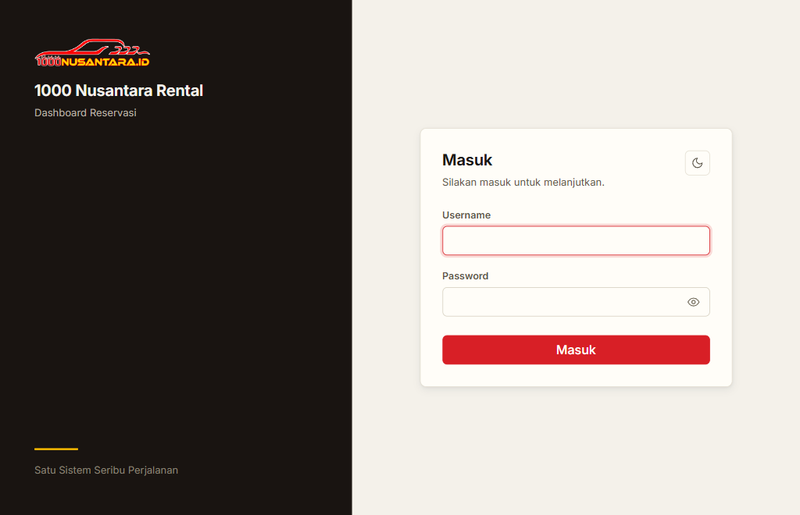

# Dashboard Reservasi — 1000 Nusantara Rental

Dashboard internal untuk mengelola reservasi armada mobil: pesanan masuk, penetapan unit &
driver, penerbitan invoice, pembayaran, sampai laporan penjualan dan piutang.

Aplikasi ini adalah **port Next.js** dari sistem lama (PHP native + Laravel). Keduanya menunjuk ke
**database MySQL yang sama** selama masa migrasi — lihat [Aturan database](#-aturan-database-baca-dulu).


<picture>
  <source media="(prefers-color-scheme: dark)" srcset="docs/img/login-gelap.png">
  
</picture>

<sub>Halaman masuk. Tema awal mengikuti pengaturan sistem; bisa diganti manual. Screenshot sengaja
hanya halaman masuk — halaman lain memuat data operasional nyata.</sub>

---

## Peran pengguna

| Peran | Yang dikerjakan | Catatan |
|---|---|---|
| **Reservasi** | Terima pesanan, input order, atur unit & driver | Pengguna terberat. **Tidak boleh melihat harga modal atau margin.** |
| **Finance** | Terbitkan invoice final, catat pembayaran, periksa piutang | Butuh ketelitian angka |
| **Superadmin** | Master data, user, pengaturan | Melihat semuanya |

Dipakai campuran **desktop** (admin di kantor, layar lebar) dan **mobile** (staf lapangan).
Tabel padat berubah jadi kartu bertumpuk di layar < 768px supaya tetap terbaca tanpa menggeser
ke samping.

## Modul

| Modul | Isi |
|---|---|
| **Beranda** | Peta modul + strip KPI, kartu "perlu ditagih", ketersediaan unit |
| **Pesanan** | Daftar berfilter, input (form terstruktur atau tempel teks WhatsApp), detail, bukti bayar, teks WA, ketersediaan |
| **Master** | Armada, driver, pelanggan, vendor, wilayah, kota, item include |
| **Keuangan** | Arus kas (riwayat pembayaran), piutang pelanggan |
| **Invoice** | Cetak 2 template (klasik & modern), lembar internal dengan modal & margin |
| **Laporan** | Penjualan (per mobil/armada/kota/reservasi), per driver, audit log |
| **Import** | CSV & Excel (mapping otomatis) |
| **Asisten Data** | Tanya-jawab bahasa sehari-hari ke data asli (butuh kunci API) |
| **Sistem & Tools** | Manajemen user, pengaturan faktur, ubah password |

---

## Tumpukan

| Lapisan | Dipakai |
|---|---|
| Runtime | **Node.js 20.9+** (diuji di 22) |
| Framework | **Next.js 16** (App Router, Turbopack) · React 19 |
| Bahasa | **TypeScript 5** (strict) |
| Styling | **Tailwind CSS v4** sebagai mesin utility; token & komponen di `src/styles/` |
| Database | **MySQL** — skema berasal dari sistem lama, diakses lewat `mysql2` |
| Sesi | Cookie berisi JWT, ditandatangani `jose` (HMAC `APP_KEY`) |
| Lain | `bcryptjs` (hash password), `exceljs` (import Excel) |
| Font | Inter (self-host, `public/assets/fonts/`) |

### Aset lama dipakai ulang apa adanya

Skrip JS dari sistem lama (`public/assets/js/app.js`, `scroll-keep.js`, `pesanan_form_ext.js`,
`parse_pesanan.js`, `laporan_chart.js`, `asisten.js`) **tidak ditulis ulang**. Skrip dimuat
berurutan oleh `src/components/skrip-muat.tsx`, lalu event `DOMContentLoaded` dipancarkan ulang
supaya inisialisasi gaya lama ikut jalan.

> **Kontrak DOM mengikat.** JS lama membaca DOM dengan string persis (`id`, `name`, `class`,
> `data-*`). Mengganti namanya akan merusak logika **tanpa pesan error**. Daftar hook ada di
> `scripts/hook-baseline.txt`.

---

## Menjalankan

Prasyarat: **Node.js 20.9+** (diuji di 22) dan akses ke database MySQL `rentalnusantara`.

```bash
npm install
cp .env.example .env
```

Isi `.env` (kredensial database minta ke pemilik proyek — tidak ada di repo):

```ini
APP_KEY=            # wajib, minimal 16 karakter; penandatangan cookie sesi & token
DB_HOST=127.0.0.1
DB_PORT=3306
DB_DATABASE=rentalnusantara
DB_USERNAME=root
DB_PASSWORD=
```

`APP_KEY` bisa diisi string acak panjang, mis.:

```bash
node -e "console.log(require('node:crypto').randomBytes(32).toString('hex'))"
```

Lalu:

```bash
npm run dev          # http://localhost:3000
```

### Perintah

| Perintah | Kegunaan |
|---|---|
| `npm run dev` | Server pengembangan (port 3000) |
| `npm run build` | Build produksi |
| `npm run start` | Jalankan hasil build (port 3000) |
| `npm run typecheck` | `tsc --noEmit` |
| `npm run lint` | ESLint |

### Mengakses dari perangkat lain (URL "Network")

Saat `npm run dev`, Next mencetak dua URL: `Local` dan `Network`. Supaya URL Network bisa dipakai
(HP di jaringan yang sama), `next.config.ts` menambahkan **semua IP LAN mesin** ke
`allowedDevOrigins` secara otomatis — tanpa itu Next memblokir aset dev lintas-origin, halaman
tetap tampil tapi tidak ter-hidrasi (menu & tombol ganti tema mati). Daftar dibaca ulang tiap
server start, jadi aman kalau IP berubah (DHCP).

---

## ⚠️ Aturan database (baca dulu)

Database `rentalnusantara` **sudah ada lebih dulu** (dibuat sistem lama) dan berisi **data
operasional nyata**. Aplikasi lama dan aplikasi ini menunjuk database yang sama.

- **JANGAN** menjalankan DDL (`CREATE`/`ALTER`/`DROP`) dari sisi aplikasi. Skema milik sistem lama
  dan **bukan** tanggung jawab kode ini.
- Migrasi/DDL tidak ada di repo ini. Kalau perlu menambah kolom, itu keputusan terpisah.
- Query aplikasi: `SELECT` untuk baca, `INSERT`/`UPDATE`/`DELETE` hanya pada baris milik aplikasi.
- Kredensial ada di `.env` (di-`gitignore`). Jangan pernah menaruhnya di kode atau commit.

## Asisten Data (opsional)

Tanpa `ASISTEN_API_KEY` fitur AI mati dengan anggun: halaman **Asisten Data** menampilkan
peringatan "belum aktif", widget tidak dirender, dan tombol **Bedah & Isi Otomatis** hanya
memakai parser deterministik (`src/lib/parse-teks.ts`) tanpa fallback model.

Untuk mengaktifkan, isi di `.env`:

```ini
ASISTEN_API_KEY=
ASISTEN_MODEL=gemini-flash-lite-latest
ASISTEN_MODEL_CADANGAN=
ASISTEN_BASE_URL=https://generativelanguage.googleapis.com/v1beta
```

---

## Struktur

```
src/
  app/
    (app)/            halaman setelah login: beranda, pesanan, master, keuangan,
                      laporan, import, asisten, pengaturan, user, profil
    (auth)/login/     halaman masuk (berdiri sendiri, tanpa shell sidebar)
    api/              endpoint JSON: asisten, parse-pesanan
    invoice/[id]/cetak/  halaman cetak invoice (CSS terisolasi, 2 template)
    logout/           route POST logout
  components/         sidebar, topbar, modal, widget asisten, pemuat skrip lama
  config/             menu sidebar, kolom tiap master, peta rute, peta modul
  lib/                helper domain: db, sesi, akses, format, settings, server per modul
  styles/             app.css (token + komponen) + per-area: beranda, master, pesanan, asisten
  proxy.ts            penjaga rute + penerus flash (pengganti nama "middleware" di Next 16)
public/assets/
  js/                 skrip lama yang dipakai ulang apa adanya
  vendor/ img/ fonts/ aset statis (tanpa build step)
docs/img/             tangkapan layar untuk README
scripts/hook-baseline.txt   daftar hook DOM yang dibaca skrip lama
```

---

## Dokumentasi

| Berkas | Isi |
|---|---|
| [`PRODUCT.md`](PRODUCT.md) | Untuk siapa, tujuan, kepribadian merek |
| [`DESIGN.md`](DESIGN.md) | Token warna, tipografi, aturan komponen, aksesibilitas |
| [`CLAUDE.md`](CLAUDE.md) | Panduan untuk AI coding agent yang bekerja di repo ini |

---

## Catatan pengembangan

**Ubah tampilan lewat token, jangan hardcode.** Semua warna hidup di `src/styles/app.css` sebagai
CSS custom property dua lapis (primitif → semantik), dengan pasangan tema terang & gelap. Tailwind
dipetakan balik ke token itu lewat `@theme inline` di `src/app/globals.css`, jadi `bg-surface`,
`text-ink`, atau `border-line` otomatis ikut tema. Baca [`DESIGN.md`](DESIGN.md) sebelum menyentuh
tampilan.

**Preflight Tailwind sengaja tidak dimuat.** Nilai dasar peramban yang bocor ditambal eksplisit di
`src/styles/app.css` (mis. `a` diberi warna & tanpa garis bawah, `button` diberi latar `--surface`
supaya tidak memakai `buttonface` abu-abu bawaan). Kalau menambah elemen mentah (`a`, `button`,
`table`), pastikan ia punya kelas dari design system.

**Bump `?v=` setiap kali skrip di `public/assets/js/` berubah.** Tidak ada cache-busting otomatis
untuk aset statis, jadi versi di query string dinaikkan manual di tiap pemakaiannya:
`src/app/layout.tsx` (`tema.js`), `src/components/skrip-muat.tsx` (`app.js`, `scroll-keep.js`,
`parse_pesanan.js`), `src/app/(app)/asisten/page.tsx` + `src/components/widget-asisten.tsx`
(`asisten.js`), dan `src/app/(app)/laporan/penjualan/page.tsx` (`laporan_chart.js`).
CSS tidak perlu `?v=` — dibundel dan di-hash oleh Next.

**Hak akses satu pintu.** `src/lib/akses.ts` memegang `roleBoleh()` dan `menuTampil()`; menu
sidebar, tombol, dan gate halaman membacanya. Jangan menyalin daftar izin ke tempat lain.

**Belum ada test otomatis.** Tidak ada jaring pengaman otomatis, jadi sebelum commit jalankan
`npm run build` + `npm run typecheck` dan uji manual di browser — terutama untuk perhitungan harga,
hak akses per peran, dan alur pesanan → invoice → pembayaran.

---

## Lisensi

MIT — lihat [`LICENSE`](LICENSE). Copyright (c) 2026 Deni Arya Winaldi.
